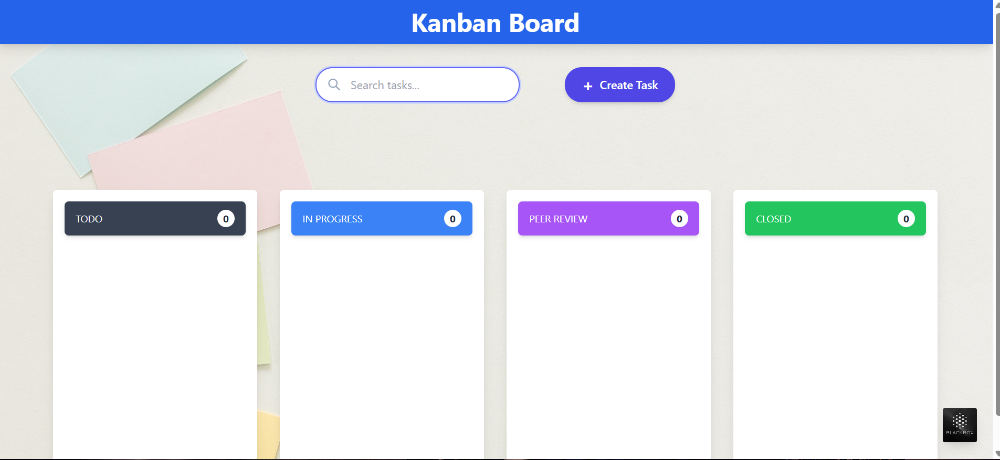
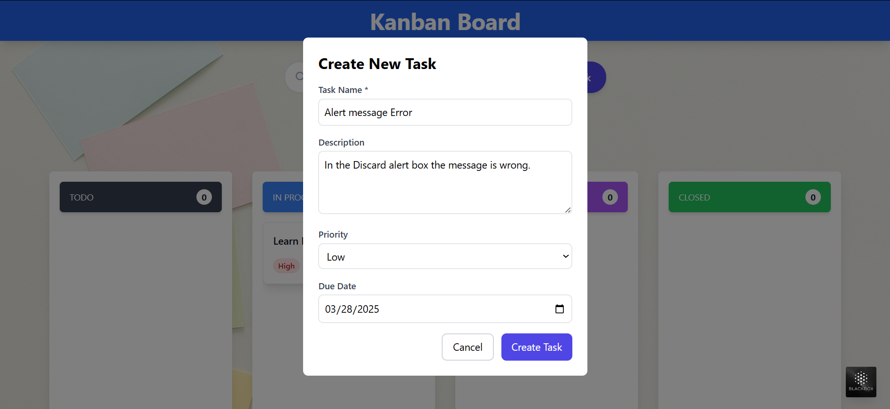
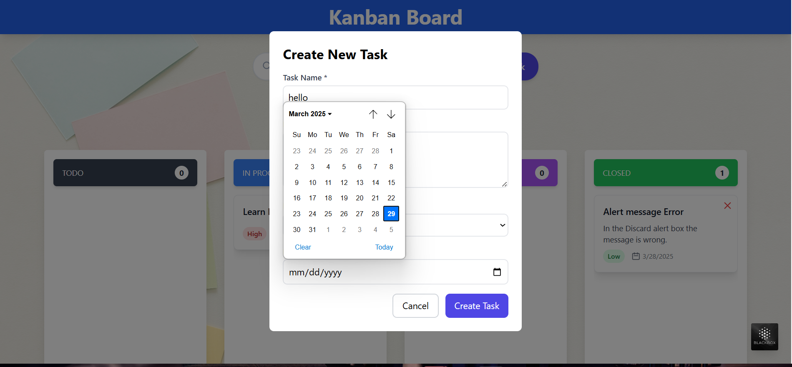
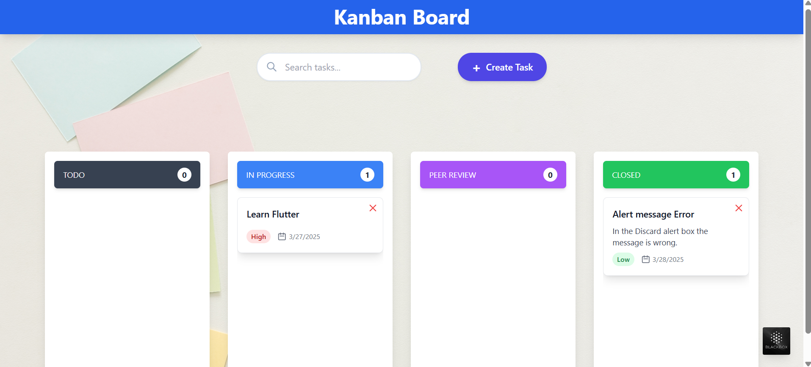

# KanbanBoard-Using-ReactJS

## Table of Contents

- [Overview](#overview)
- [Installation](#installation)
- [Features](#features)
- [Screenshots](#screenshots)
- [Technology Stack](#technology-stack)

## Overview

KanbanBoard is a task management application built using **React, Redux, and Tailwind CSS**. It enables users to efficiently manage their tasks with features like task creation, deletion, updating task status, and filtering tasks. The app provides a **drag-and-drop interface** for managing tasks across different statuses such as "To Do", "In Progress", "Peer Review", and "Closed".

## Installation

Follow these steps to set up the project locally:

1. **Clone the repository:**
   ```bash
   git clone https://github.com/YourUsername/KanbanBoard-using-ReactJs.git
   ```

2. **Navigate to the project directory:**
   ```bash
   cd KanbanBoard
   ```

3. **Install dependencies:**
   ```bash
   npm install
   ```

4. **Start the development server:**
   ```bash
   npm run dev
   ```

5. **Build for production:**
   ```bash
   npm run build
   ```

## Features

- **Task Management:** Add, update, delete, and reorder tasks.
- **Drag & Drop:** Move tasks between different status columns.
- **Search & Filter:** Quickly find tasks based on keywords.
- **Responsive Design:** Fully functional on mobile and desktop devices.


## Screenshots







## Technology Stack

- **Frontend:** React.js, Redux
- **Styling:** Tailwind CSS
- **State Management:** Redux Toolkit
- **Drag & Drop:** React DnD


---

For any questions or issues, feel free to raise an issue on **GitHub** or contribute to the project. 🚀

