<<<<<<< HEAD
# KanbanBoard-Using-ReactJS
=======
# Task Management Application

[](https://fluffy-tanuki-c0bc5b.netlify.app/)


## Deployment
The web app is live and can be accessed [here](https://fluffy-tanuki-c0bc5b.netlify.app/).

## Table of Contents

* [Overview](#Overview)
* [Installation](#Installation)
* [Features](#Features)
* [Technologies Used](#Technologies-Used)
* [Components](#Components)
* [State Management](#State-Management)
* [Styling](#Styling)
* [Screenshots](#Screenshots)
* [Contributing](#Contributing)

## Overview

This is a task management application built using React, Redux, and Tailwind CSS. It supports task creation, deletion, updating task status, and filtering tasks based on a search query. The application also provides a drag-and-drop interface for managing tasks across different statuses like "To Do", "In Progress", "Peer Review", and "Closed".

## Installation

Clone the repository:

```bash
    git clone https://github.com/AbhishekIT22112002/KanbanBoard.git
```

To access directory:

```bash
    cd KanbanBoard
```

Install dependencies:

```bash
    npm install
```

Start the development server:

```bash
    npm run dev
```

Build for production:

```bash
    npm run build
```

## Features

1. **Add Task:**
    - Click on the "Create Task" button to open a modal where you can enter the task name and description.
    - Click "Add Task" to save the task.

2. **Managing Tasks:**
    - Tasks can be dragged and dropped between different sections ("To Do", "In Progress", "Peer Review", and "Closed").
    - You can also delete tasks by clicking the delete icon.

3. **Searching Tasks:**
    - Use the search input to filter tasks by their name.
    - The task list will update in real-time as you type.

4. **Responsive Design:**
    - The application is responsive and works well on mobile devices.

## Technologies Used

- **React**: A JavaScript library for building user interfaces. 

- **Redux**: A state management tool for managing application state.

- **React DnD**: A drag-and-drop library for React applications.

- **React Hot Toast**: Notifications for task actions like creation and deletion.

- **Tailwind CSS**: Utility-first CSS framework for styling.

- **uuid**: For generating unique task IDs

## Components

1. **App.jsx**

    This is the root component that integrates all the main features of the application. It sets up the drag-and-drop context using ***DndProvider***, initializes the tasks from local storage, and manages the layout of the main components like ***Search***, ***CreateButton***, and ***ListTasks***.

2. **CreateButton.jsx**

    A button that opens a modal for creating a new task. It uses Tailwind CSS for styling and handles the opening and closing of the modal.

3. **CreateTask.jsx**

    A form inside the modal where users can enter the task name and description. It dispatches the addTask action to save the new task.

4. **Header.jsx**

    Displays the section header, including the title and the count of tasks in that section.

5. **ListTasks.jsx**

    Renders the sections of tasks categorized by their status ("To Do", "In Progress", "Peer Review", "Closed"). Each section displays tasks that can be dragged and dropped.

6. **Modal.jsx**

    A modal component that wraps the ***CreateTask*** form. It handles closing the modal and includes a close button.

7. **Search.jsx**

    An input field that allows users to search tasks by name. It updates the ***searchQuery*** in the Redux store.

8. **Section.jsx**

    Renders a specific task section based on status. It integrates the drag-and-drop functionality and displays tasks that belong to that section.

9. **Task.jsx**

    Represents an individual task in the list. It supports dragging to move the task between sections and includes a delete button to remove the task.

## State Management

The application uses Redux for state management, particularly the ***taskSlice*** for handling tasks and search functionality.

1. **taskSlice.js**

    - **State Structure:**
        - ***tasks***: An array of task objects.
        - ***filteredTasks***: An array of tasks filtered by the search query.
        - ***searchQuery***: The current search query string.

    - **Reducers:**
        - ***setTasks***: Sets the list of tasks.
        - ***addTask***: Adds a new task to the list.
        - ***removeTask***: Removes a task from the list.
        - ***updateTaskStatus***: Updates the status of a task (e.g., from "To Do" to "In Progress").
        - ***setSearchQuery***: Updates the search query for filtering tasks.

2. **store.js**

    Configures the Redux store and integrates the ***taskSlice*** reducer.

## Styling

- **Tailwind CSS:** Used for styling components. The utility-first CSS framework allows for quick and responsive design.

- **Custom CSS:** Some components use additional custom styles for specific UI elements, such as the modal.

## Screenshots

Add screenshots of your application here to demonstrate its functionality.

- **Main Screen:**

    - *Chrome View*

        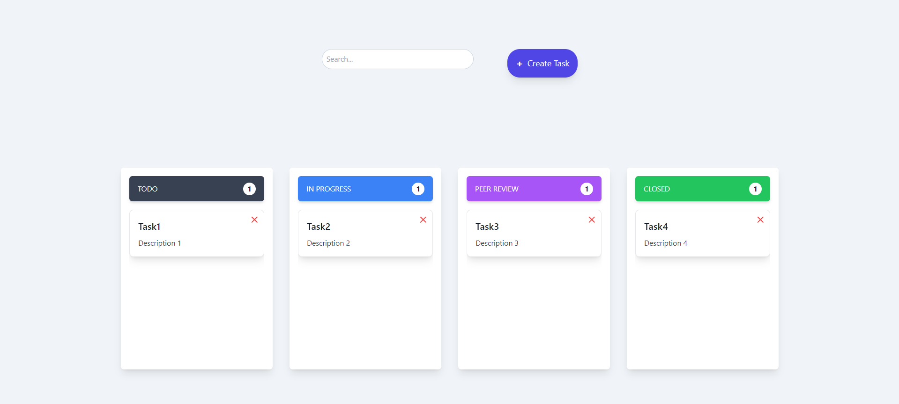 

    - *Mobile View*
        
        [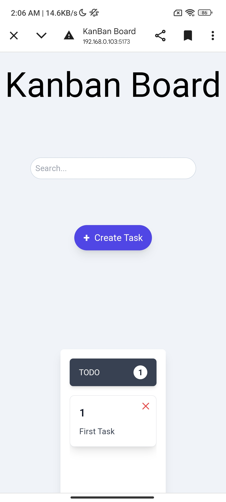](src/assets/Mobile-View/Main-Screen1.jpg)

        [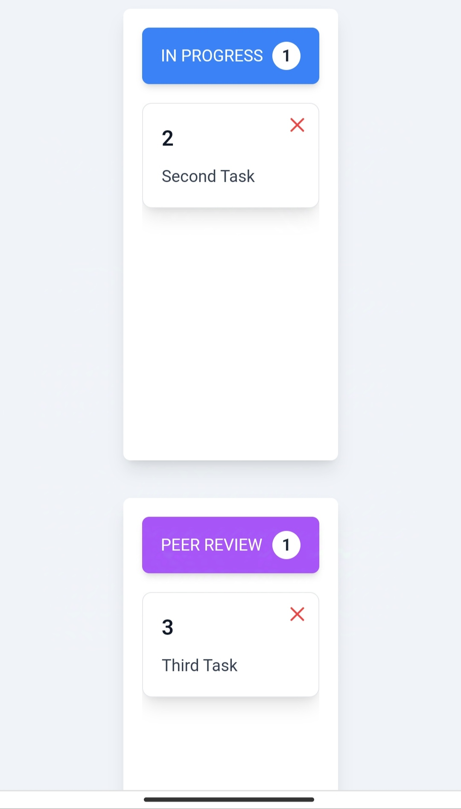](src/assets/Mobile-View/Main-Screen2.jpg)

        [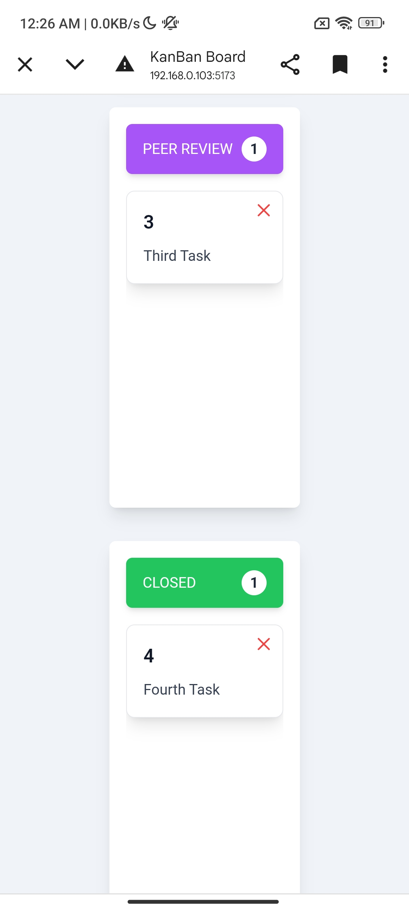](src/assets/Mobile-View/Main-Screen3.jpg)


- **Create Task Modal:**

    - *Chrome View*

        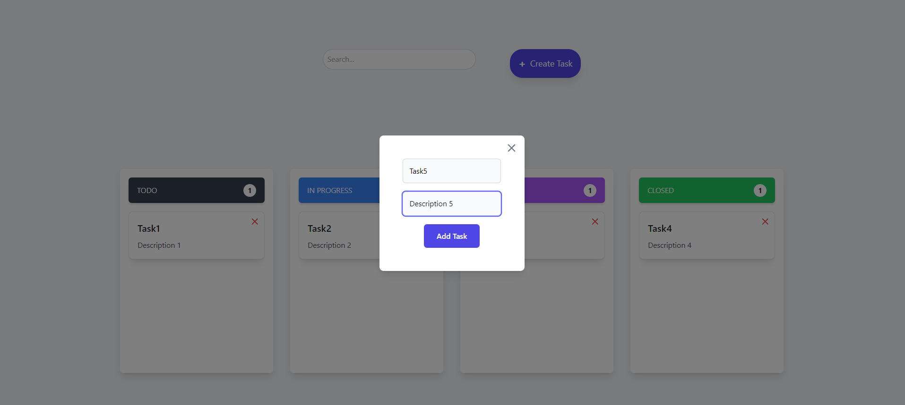

    - *Mobile View*

        [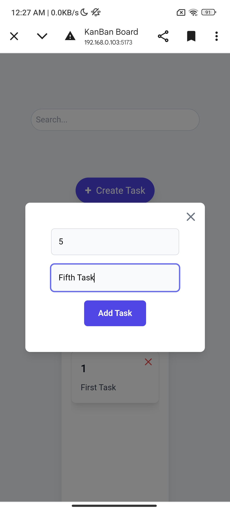](src/assets/Mobile-View/Add-Task.jpg)


- **Drag and Drop:**

    - *Chrome View*

        **Drag**

        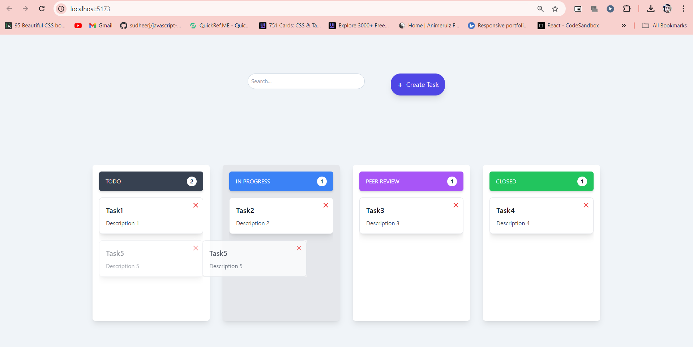

        **Drop**

        


    - *Mobile View*

        **Drag**

        - *Tap on the which you want to drag*

        [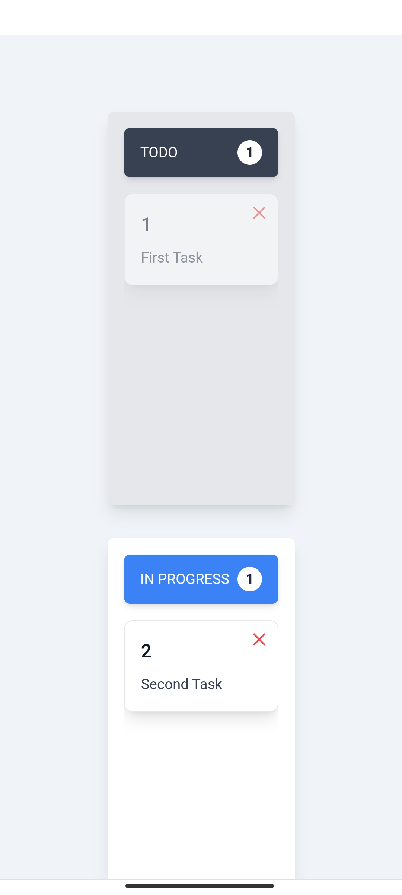](src/assets/Mobile-View/Drag.jpg)

        **Drop**

        - *Then drag till the box where you want to drop that item*

        [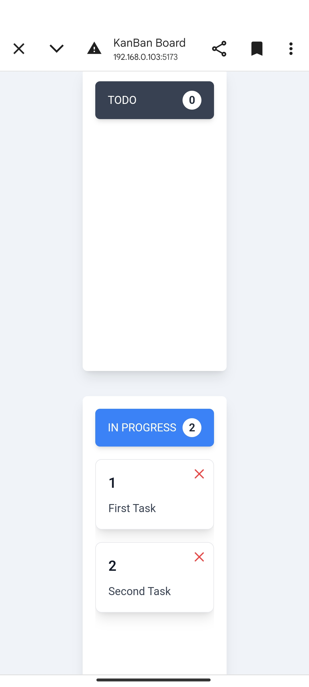](src/assets/Mobile-View/Drop.jpg)


- **Search Task**

    - *Chrome View*

        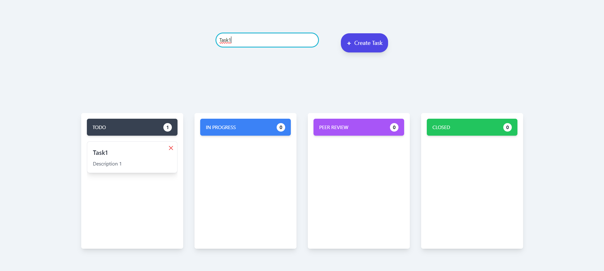

    - *Mobile View*

        - *Search the task you want to*

        [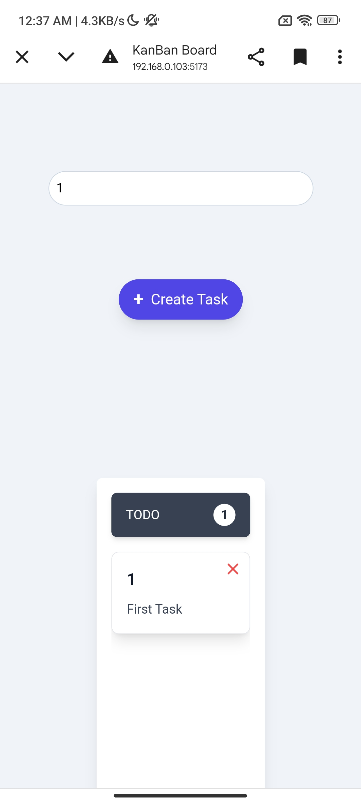](src/assets/Mobile-View/Search-1.jpg)

        [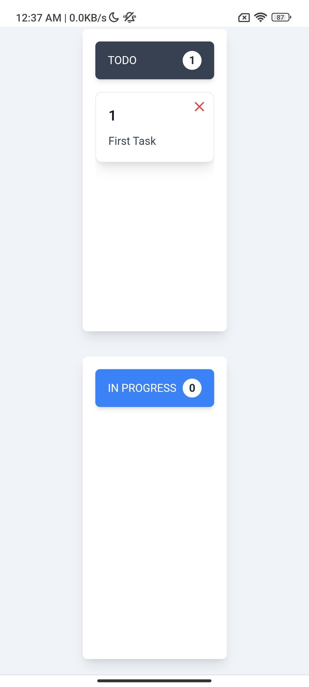](src/assets/Mobile-View/Search-2.jpg)


## Contributing

Contributions are welcome! Please open an issue or submit a pull request for any changes.
>>>>>>> ca8f342 (Initial commit)
